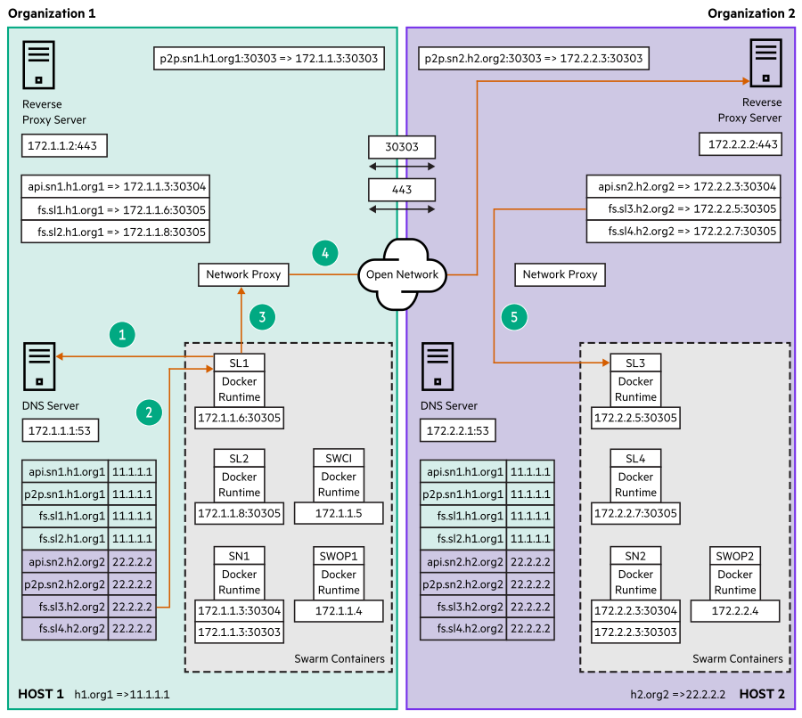

# Swarm Learning Component Interactions using Reverse Proxy 

A Reverse Proxy Server is a type of proxy server that presents behind the firewall in a private network and directs client requests to appropriate backend or origin servers. Reverse Proxy for Swarm Learning is used to minimize the number of network ports that must be opened for communication between various host machines. An Open port refers to a TCP or UDP port number that is configured to accept packets.

The following illustration is the multi-organization setup using reverse proxy:

Swarm Learning currently communicates between machines by enabling a different set of pre-defined ports on each machine. For example, SN-API-PORT, SL-FS-PORT, SN-P2P-PORT \(aka opening\), and so on. Enabling all of these ports between all machines is a time-consuming process. Moreover, opening many ports may make the system more vulnerable to security attacks.

SN serves as the hub for all major communications among the Swarm nodes. Using a Reverse Proxy will convert tunnel all port-based communications through a single default https port of 443. Currently, SN P2P service still uses 30303 port and not the https port, hence the SN P2P service must also be opened for each SN node. Rather than externalizing ports, we create services and manage them with unique fully qualified domain names. The routing mechanism is managed through reverse proxy (for example, NGINX). Reverse Proxy approach will avoid the need of opening up multiple SN-API-PORT & SN-P2P-PORTs.

**NOTE:** Typically Reverse proxy runs on the default https port of 443 which would be opened up in most organizations. If its configured to run on any other port, then that port must be opened up.

**Table 1:**
|<strong>Service</strong>|<strong>Description</strong>|
|------------------------------------------|----------------------------|
|**SN API Service**|This API service \(aka Fully Qualified Domain Name\) is used by the SL nodes to send and receive state information from the SN node that they are registered with. It is also used by SWCI and SWOP nodes to manage and view the status of the Swarm Learning Framework. This parameter is used to tunnel the requests via reverse proxy to the API service using an HTTPS port instead of an SN API port. Either IP along with the SN API port or this SN API service is required.  \(Default port used along with this FQDN is 443\). |
|**SN P2P Service**|This P2P service \(aka Fully Qualified Domain Name\) is used by the each SN node to share blockchain internal state information with the other SN nodes. This FQDN parameter is used as an alias for the SN P2P port based ethereum communications via reverse proxy. Either SN node's IP & P2P port or this SN P2P Service is required.  \(Default port used along with this FQDN is 30303\). |
|**SL FS Service**|This File Server \(FS\) service \(aka Fully Qualified Domain Name\) is used by each SL node to run a file server. This FS service is used to share insights learned from training the model with the other SL nodes in the network. This parameter is used to tunnel the requests via reverse proxy to the File server using HTTPS port instead of SL FS Port. Either SL node's IP and FS port or this SL FS Service is required.  \(Default port used along with this FQDN is 443\). |

**NOTE:**

SN P2P Service still uses 30303 port.

SN P2P service uses 30303 port and needs to be opened for each SN node.

